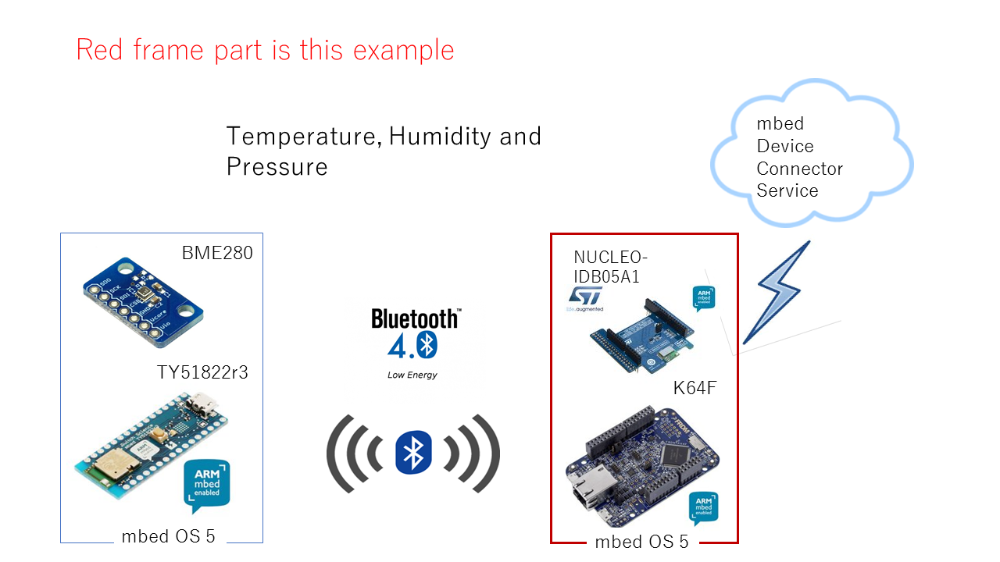

# BLEClient_mbedDevConn

This example includes 2 main features.
* [**BLE GATT Client** - receiving sensor data on field](#ble-gatt-client-for-bme280)
* [**mbed Client** - transferring sensor data up on cloud](#mbed-client-on-mbed-os)


# BLE GATT Client for BME280

The ``GattClient`` APIs are used to implement BLE GATT client. this feature communicates with another GATT server device.

1. The GATT Server device - runs the application ``BLE_Server_BME280`` from [ here ](https://github.com/soramame21/BLE_Server_BME280), which broadcasts measured values of BME280 over BLE.
1. The GATT Client device - runs the application ``BLEClient_mbedDevConn`` to receive broadcast data over BLE.

Please note: The application ``BLEClient_mbedDevConn`` initiates a connection to all ble devices which advertise "BME280" as complete local name. By default, the application `BLE_Server_BME280` advertise "BME280" as complete local name. If you change the local name advertised by the application `BLE_Sever_BME280` you should reflect your change in this (GATT Client) application by changing the value of the constant `PEER_NAME` in `main.cpp`.

# mbed Client on mbed OS

The mbed Client working on mbed OS demonstrates how to register a device with mbed Device Connector, how to read a device/resource and how to deregister. If you are unfamiliar with mbed Device Connector, it is recommended that you read [the introduction to the data model](https://docs.mbed.com/docs/mbed-device-connector-web-interfaces/en/latest/#the-mbed-device-connector-data-model) first.

The application:

* Connects to network via Ethernet connection.
* Registers with mbed Device Connector.
* Gives mbed Device Connector access to its resources (read only).
* Reads value from the sensor (BME280) & display the same using HTTP GET request.

## Required hardware

* K64F target platform .
* ST BLE shield X-NUCLEO-IDB05A1 running v7.2 or later firmware. [The latest firmware is at here]( https://developer.mbed.org/teams/ST/code/BlueNRG-MS-Stack-Updater/)
* 1x micro-USB cable.
* Ethernet cable and connection to the internet.


## Tested Target hardware configurations

 * K64F (Ethernet)

## Requirements for non-K64F boards

*   This example requires TLS functionality to be enabled on mbed TLS.
    On devices where hardware entropy is not present, TLS is disabled by default.
    This would result in compile time failures or linking failures.

    To learn why entropy is required, read the
    [TLS Porting guide](https://docs.mbed.com/docs/mbed-os-handbook/en/5.2/advanced/tls_porting/).

## Required software

* [ARM mbed account](https://developer.mbed.org/account/login/?next=/).
* [mbed-cli](https://github.com/ARMmbed/mbed-cli) - to build the example programs. To learn how to build mbed OS applications with mbed-cli, see [the user guide](https://github.com/ARMmbed/mbed-cli/blob/master/README.md).
* [Serial port monitor](https://developer.mbed.org/handbook/SerialPC#host-interface-and-terminal-applications).
* [mbed Device Connector account](https://connector.mbed.com/)

## Application setup

To configure the example application:

1. [Select the connection type](#connection-type).
1. [Set the client credentials](#client-credentials).
1. [Change Ethernet settings](#ethernet-settings).
1. [Set up an IP address](#ip-address-setup). This step is optional.
1. [Change the socket type](#changing-socket-type). This step is optional.

### Connection type

The application uses Ethernet as the default connection type. To change the connection type, set one of them in `mbed_app.json`. For example to select ETHERNET.

```json
    "network-interface": {
        "help": "options are ETHERNET,WIFI,MESH_LOWPAN_ND,MESH_THREAD.",
        "value": "ETHERNET"
    }
```

### Client credentials

To register the application with the Connector service, you need to create and set the client side certificate.

1. Go to [mbed Device Connector](https://connector.mbed.com) and log in with your mbed account.
1. On mbed Device Connector, go to [My Devices > Security credentials](https://connector.mbed.com/#credentials) and click the **Get my device security credentials** to get new credentials for your device.
1. Replace the contents in the `security.h` file of this project's directory with the content copied above.

### Ethernet settings

For running the example application using Ethernet, you need:

- An Ethernet cable.
- An Ethernet connection to the internet.

### IP address setup

This example uses IPv4 to communicate with the [mbed Device Connector Server](https://api.connector.mbed.com). The example program should automatically get an IPv4 address from the router when connected over Ethernet.

If your network does not have DHCP enabled, you have to manually assign a static IP address to the board. We recommend having DHCP enabled to make everything run smoothly.

### Changing socket type

Your device can connect to mbed Device Connector via UDP or TCP binding mode. The default is UDP.

To change the binding mode:

1. In the `simpleclient.h` file, find the parameter `SOCKET_MODE`. The default is `M2MInterface::UDP`.
1. To switch to TCP, change it to `M2MInterface::TCP`.
1. Rebuild and flash the application.

<span class="tips">**Tip:** The instructions in this document remain the same, irrespective of the socket mode you select.</span>

## Building and running the example

To build the example using mbed CLI:

1. Open a command line tool and navigate to the project’s directory.

2. Clone this repo.

3. [Configure](#application-setup) the client application.

4. To build the application, select the hardware board and build the toolchain using the command:

    ```
    mbed compile -m K64F -t ARM -c
    ```

    mbed CLI builds a binary file under the project’s `BUILD/` directory.

5. Plug the Ethernet cable into the board if you are using Ethernet mode.

6. Plug the micro-USB cable into the board. The board is listed as a mass-storage device.

7. Drag the binary `BUILD/K64F/ARM/*.bin` to the board to flash the application.

8. The board is automatically programmed with the new binary. A flashing LED on it indicates that it is still working. When the LED stops blinking, the board is ready to work.

9. Build and install ``BLE_Server_BME280`` according to [instructions at here](https://github.com/soramame21/BLE_Server_BME280).

10. Press the **Reset** button on K64F board flashed at Step 8 to run the program ``BLEClient_mbedDevConn``.

11. For verification, continue to the [Monitoring the application](#monitoring-the-application) chapter.

## Monitoring the application

You need a terminal program to listen to the output through a serial port. You can download one, for example:

* Tera Term / PuTTY for Windows.
* CoolTerm for Mac OS X.
* GNU Screen for Linux.

To see the application's output:

1. Check which serial port your device is connected to.
1. Run a terminal program with the correct serial port and set the baud rate to 9600. For example, to use GNU Screen, run: ``screen /dev/tty.usbmodem1412 9600``.
1. The application should start printing the measured value to the terminal.

**Note:** ``BLEClient_mbedDevConn`` will not run properly if the ``BLE_Server_BME280`` application is not running on a second device. The terminal will show a few print statements, but you will not be able to see received data.


After connecting, you should see messages about connecting to mbed Device Connector:

```
Connected to Network successfully
IP address 10.128.4.46

SOCKET_MODE : TCP
Connecting to coap://api.connector.mbed.com:5684
created bme280 instance now!!
I'm inside BLE thread_init.....
I'm inside BLE init Complete
BLE Error startScan = 0
inside main for client

Registered object successfully!
adv peerAddr[df 28 cb 9b 5a b8] rssi -60, isScanResponse 0, AdvertisementType 0
Connected to BME280 now...
ble.gattClient().launchServiceDiscovery = 0
S type short UUID-181a attrs[12 255]
  C UUID-2a6f valueAttr[14] props[0]
 is_active[HUMIDITY] = true
  C UUID-2a6d valueAttr[16] props[0]
 is_active[PRESSURE] = true
  C UUID-2a6e valueAttr[18] props[0]
 is_active[TEMPERATURE] = true
terminated SD for handle 2049
Humidity  = 99.50%
Pressure  = 995.0 hPa
inside main for client
Temperature  = 25.69 degC
Humidity  = 36.00%
Pressure  = 995.0 hPa
Temperature  = 25.70 degC
```
<span class="notes">**Note:** Device name is the endpoint name you will need later on when [testing the application](https://github.com/ARMmbed/mbed-os-example-client#testing-the-application).</span>

## Testing the application

Please refer the [details at here](/docs/testing.md)


## Overview



Please find the BLE GATT Server application under https://github.com/soramame21/BLEClient_mbedDevConn repo.
